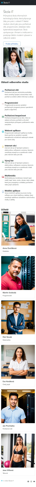
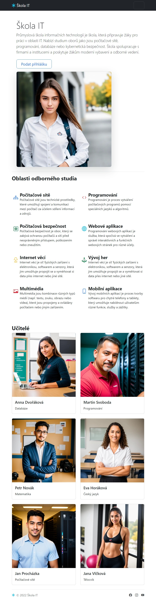
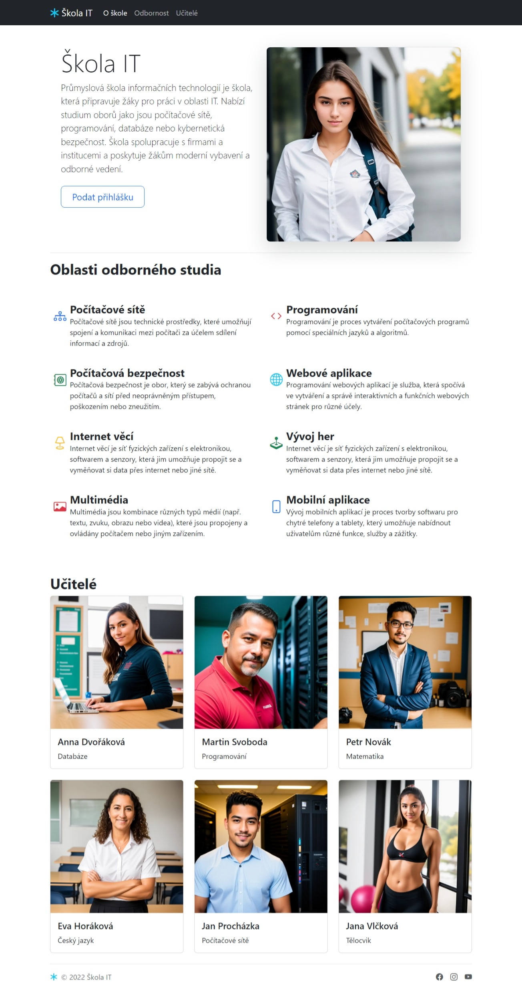

# Cvičení na responsivitu stránek v Bootstrapu

Vytvořte stránku podle vzoru tak, aby její vzhled odpovídal screenshotům ve všech třech velikostech.

## Cílová zařízení

### Mobilní telefon

* Všechny prvky obsahu jsou v jednom sloupci pod sebou.
* Menu je schované pod "hamburger" tlačítko.

### Tablet (md - ≥768px)

* Odbornosti i učitelé jsou ve dvou sloupcích.
* Menu je schované pod "hamburger" tlačítko.

### Desktop (lg - ≥992px)

* Fotografie v záhlaví je vedle textu.
* Odbornosti jsou ve dvou sloupcích.
* Učitelé jsou ve třech sloupcích.
* Menu je normálně rozbalené.

## Pomocné kódy

Položka odbornosti

    

        <i class="bi bi-joystick fs-3 p-2 text-success"></i>
        

        <h3 class="fw-bold mb-0 fs-4">Vývoj her</h3>
        
Internet věcí je síť fyzických zařízení s elektronikou, softwarem a senzory, která jim umožňuje propojit se a vyměňovat si data přes internet nebo jiné sítě.

        

    

## Texty

Průmyslová škola informačních technologií je škola, která připravuje žáky pro práci v oblasti IT. Nabízí studium oborů jako jsou počítačové sítě, programování, databáze nebo kybernetická bezpečnost. Škola spolupracuje s firmami a institucemi a poskytuje žákům moderní vybavení a odborné vedení.

Počítačové sítě jsou technické prostředky, které umožňují spojení a komunikaci mezi počítači za účelem sdílení informací a zdrojů.

Programování je proces vytváření počítačových programů pomocí speciálních jazyků a algoritmů.

Počítačová bezpečnost je obor, který se zabývá ochranou počítačů a sítí před neoprávněným přístupem, poškozením nebo zneužitím.

Programování webových aplikací je služba, která spočívá ve vytváření a správě interaktivních a funkčních webových stránek pro různé účely.

Internet věcí je síť fyzických zařízení s elektronikou, softwarem a senzory, která jim umožňuje propojit se a vyměňovat si data přes internet nebo jiné sítě.

Internet věcí je síť fyzických zařízení s elektronikou, softwarem a senzory, která jim umožňuje propojit se a vyměňovat si data přes internet nebo jiné sítě.

Multimédia jsou kombinace různých typů médií (např. textu, zvuku, obrazu nebo videa), které jsou propojeny a ovládány počítačem nebo jiným zařízením.

Vývoj mobilních aplikací je proces tvorby softwaru pro chytré telefony a tablety, který umožňuje nabídnout uživatelům různé funkce, služby a zážitky.

* Anna Dvořáková Databáze
* Martin Svoboda Programování
* Petr Novák Matematika
* Eva Horáková Český jazyk
* Jan Procházka Počítačové sítě
* Jana Vlčková Tělocvik

## Ikonky

* bi-diagram-3
* bi-code
* bi-safe2
* bi-globe2
* bi-joystick
* bi-card-image
* bi-phone
* bi-asterisk
